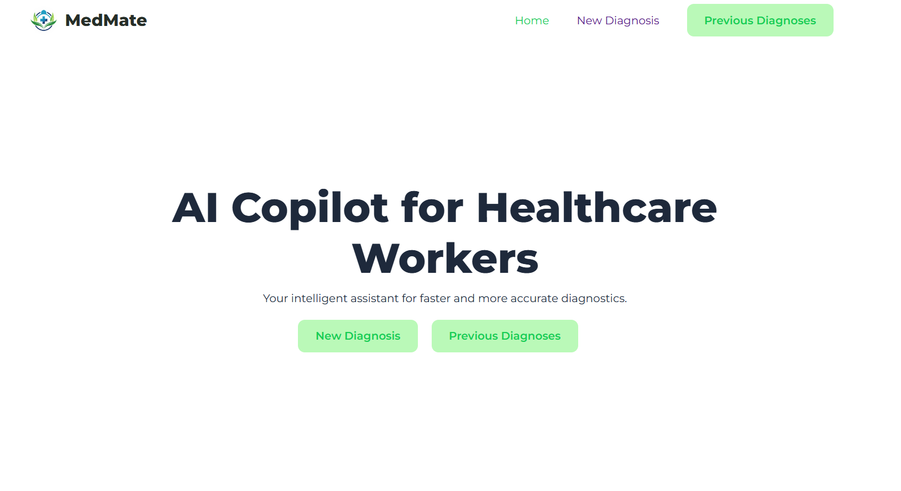
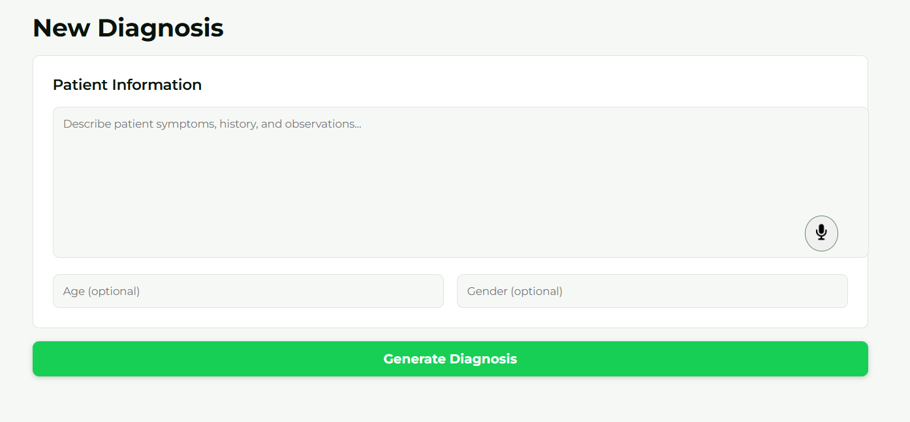
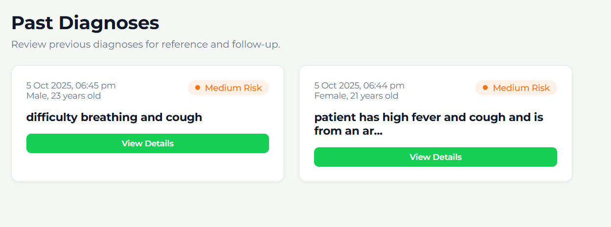

# 🏥 MedMate AI

### AI-Powered Clinical Decision Support for Rural Healthcare

_Empowering non-doctor healthcare workers with intelligent diagnosis assistance_

[Demo](#-demo) • [Features](#-features) • [Tech Stack](#-tech-stack)

---

## 🌟 Overview

**MedMate AI** is a revolutionary clinical decision support system designed specifically for healthcare workers in rural and low-resource settings. Built during a hackathon to address the critical shortage of doctors in remote areas, this application leverages cutting-edge AI technology to provide immediate, reliable medical guidance.

The system analyzes patient symptoms and provides:

- 🔍 Differential diagnosis of possible conditions
- ⚡ Immediate next steps for treatment
- 🚨 Emergency risk level assessment
- 👨‍👩‍👧‍👦 Family care instructions

All recommendations are grounded in **MSF (Médecins Sans Frontières) medical guidelines**, ensuring clinical accuracy and safety.

---

## ✨ Features

### 🎯 Core Functionality

- **Symptom Analysis**: Input patient symptoms via text or voice (speech-to-text)
- **AI-Powered Diagnosis**: Leverages Meta's Llama 3.3 70B model for intelligent clinical reasoning
- **Risk Stratification**: Automatic categorization into High/Medium/Low risk levels
- **Offline-Ready**: Diagnosis history stored locally for reference without internet

### 🔐 Smart Features

- **Context-Aware Responses**: Uses ChromaDB vector database to retrieve relevant MSF guideline sections
- **Voice Input**: Speech recognition for hands-free symptom entry (Chrome, Edge, Safari)
- **Diagnosis History**: Browse and review previous patient assessments
- **Responsive Design**: Works seamlessly on desktop and mobile devices

### 🎨 User Experience

- Clean, intuitive interface designed for healthcare workers with varying tech skills
- Visual risk indicators with traffic-light color coding
- Quick-access patient information cards
- Expandable detailed diagnosis views

---

## 🚀 Demo

_Homepage_

_AI-generated diagnosis with risk assessment_

_Diagnosis history for follow-up reference_

---

## 🛠️ Tech Stack

### Frontend

- **React** - Modern UI library for building interactive interfaces
- **React Speech Recognition** - Web Speech API integration for voice input
- **CSS3** - Custom styling for healthcare-optimized design

### Backend

- **Flask** - Lightweight Python web framework
- **Cerebras AI API** - Ultra-fast inference platform
- **Meta Llama 3.3 70B** - State-of-the-art large language model

### Database

- **ChromaDB** - Vector database for semantic search of medical guidelines
- **LocalStorage** - Client-side storage for diagnosis history

---

## 🔬 How It Works

### 1. Symptom Input

User enters patient symptoms via keyboard or voice input (using Web Speech API).

### 2. Context Retrieval

ChromaDB performs semantic search to find relevant MSF guideline sections based on symptoms.

### 3. AI Processing

- Symptoms + retrieved context sent to Cerebras API
- Meta Llama 3.3 70B model generates structured diagnosis
- JSON schema ensures consistent output format

### 4. Response Display

- Possible conditions listed
- Immediate next steps provided
- Emergency level assessed (High/Medium/Low)
- Family instructions shown

### 5. Local Storage

Diagnosis saved to browser's localStorage for offline access and historical review.

---

## 🎯 JSON Schema

The AI returns structured data following this schema:

{
    "possible_conditions": "string",
    "immediate_next_steps": "string",
    "emergency": {
        "basic_info": "string",
        "level": "high risk | medium risk | low risk"
    },
    "family_instructions": "string",
}

---

## 👥 Team

Built with ❤️ by Team CoreDumped

---

## 🙏 Acknowledgments

- **Médecins Sans Frontières** for comprehensive medical guidelines
- **Meta AI** for Llama 3.3 70B model
- **Cerebras** for ultra-fast AI inference
- **Healthcare workers worldwide** who inspired this project

---

**⭐ Star this repo if you find it helpful!**

Made with ❤️ for rural healthcare workers

